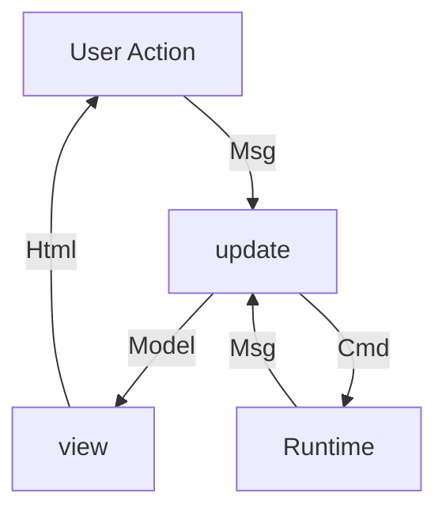

# Rabbita Web Framework API Reference

Rabbita (v0.11.5) は MoonBit 向けの宣言的・関数型 Web UI フレームワーク。The Elm Architecture (TEA) に触発され、Elm/Redux/Iced/Lustre 系の設計思想を持つ。

- リポジトリ: https://github.com/moonbit-community/rabbita
- テンプレート: https://github.com/moonbit-community/rabbita-template
- パッケージ名: `moonbit-community/rabbita`
- バンドルサイズ: 約 15KB (min+gzip)

## パッケージ構成

```txt
moonbit-community/rabbita          # コアモジュール（Cell, App, Cmd）
moonbit-community/rabbita/html     # HTML DSL
moonbit-community/rabbita/svg      # SVG DSL
moonbit-community/rabbita/cmd      # Cmd ヘルパー（低レベル API）
moonbit-community/rabbita/http     # HTTP リクエスト
moonbit-community/rabbita/nav      # ナビゲーション・スクロール
moonbit-community/rabbita/url      # URL パース・型
moonbit-community/rabbita/dom      # ブラウザ DOM バインディング
moonbit-community/rabbita/js       # JavaScript FFI ユーティリティ
moonbit-community/rabbita/clipboard # クリップボード操作
moonbit-community/rabbita/dialog   # ダイアログ制御
moonbit-community/rabbita/variant  # 型付き Variant 値
moonbit-community/rabbita/html/canvas # Canvas 2D コンテキスト取得
```

## Core: `@rabbita`

### 型

| 型 | 説明 |
|:--|:--|
| `Cell` | model/update/view をカプセル化した不透明な状態ユニット |
| `App` | マウント済みアプリケーション |
| `Cmd` | ランタイムが実行する遅延副作用 |
| `Html` | 仮想 DOM ノード（`@html.Html` のエイリアス） |
| `Dispatch[Msg]` | `(Msg) -> Cmd` 型エイリアス。メッセージをコマンドに変換 |

### Cell 作成関数

#### `simple_cell` -- 副作用なしの基本セル

```moonbit
fn[Model, Msg] simple_cell(
  model~ : Model,
  update~ : (Msg, Model) -> Model,
  view~ : (Dispatch[Msg], Model) -> Html,
) -> Cell
```

update が Model のみを返す最もシンプルな形式。副作用は不要な場合に使う。

```moonbit
struct Model { count : Int }
enum Msg { Inc; Dec }

let app = @rabbita.simple_cell(
  model={ count: 0 },
  update=(msg, model) => {
    match msg {
      Inc => { count: model.count + 1 }
      Dec => { count: model.count - 1 }
    }
  },
  view=(dispatch, model) => {
    div([
      h1("\{model.count}"),
      button(on_click=dispatch(Inc), "+"),
      button(on_click=dispatch(Dec), "-"),
    ])
  },
)
```

#### `cell` -- 副作用ありのフルセル

```moonbit
fn[Model, Msg] cell(
  model~ : Model,
  update~ : (Dispatch[Msg], Msg, Model) -> (Cmd, Model),
  view~ : (Dispatch[Msg], Model) -> Html,
) -> Cell
```

update が `(Cmd, Model)` を返す。`Dispatch[Msg]` を受け取るため、update 内で将来のメッセージをスケジューリングできる。

```moonbit
enum Msg { Inc; IncLater; Reset }

fn update(dispatch : Dispatch[Msg], msg : Msg, count : Int) -> (Cmd, Int) {
  match msg {
    Inc => (none, count + 1)
    IncLater => (delay(dispatch(Inc), 300), count)
    Reset => (none, 0)
  }
}
```

#### `cell_with_dispatch` -- dispatch を外部に公開

```moonbit
fn[Model, Msg] cell_with_dispatch(
  model~ : Model,
  update~ : (Dispatch[Msg], Msg, Model) -> (Cmd, Model),
  view~ : (Dispatch[Msg], Model) -> Html,
) -> (Dispatch[Msg], Cell)
```

セルと同時に `Dispatch[Msg]` を返す。ルーティングや外部からのメッセージ送信に使う。

#### `simple_cell_with_dispatch`

```moonbit
fn[Model, Msg] simple_cell_with_dispatch(
  model~ : Model,
  update~ : (Msg, Model) -> Model,
  view~ : (Dispatch[Msg], Model) -> Html,
) -> (Dispatch[Msg], Cell)
```

#### `static_cell` -- 静的 HTML

```moonbit
fn static_cell(html : Html) -> Cell
```

常に同じ HTML を返すセル。ただし公式ドキュメントでは HTML を返す関数で十分とされる。

### Cell の view 呼び出し

```moonbit
fn Cell::view(self : Self) -> Html
```

セルの現在の状態を `Html` としてレンダリング。親の `view` 関数内で呼ぶ。

### App API

```moonbit
fn new(Cell) -> App                    -- ルート Cell から App を作成
fn App::mount(self, String) -> Unit    -- DOM 要素 ID にマウント
fn App::with_route(                    -- ルーティングコールバック登録
  self,
  url_changed? : (Url) -> Cmd,
  url_request? : (UrlRequest) -> Cmd,
) -> Unit
fn App::with_init(self, Cmd) -> Unit   -- マウント時に実行する初期コマンド [unstable]
```

### SSR

```moonbit
fn render_to_string(Cell) -> String    -- [unstable] セルを HTML 文字列に変換
```

ハイドレーションは未対応。クライアントでマウントすると完全に再レンダリングされる。

## Cell アーキテクチャ

### TEA ループの流れ



`simple_cell` の場合は `update -> Model -> view` の単純なループ。`cell` の場合は `update -> (Cmd, Model)` で Cmd をランタイムに渡し、ランタイムが非同期処理後に再度 Msg を送る。

### セルの合成（マルチセル）

各セルは独自の Model/Update/View を持ち、dirty なセルのみ VDOM diff/patch が走る。

```moonbit
fn plan(name : String) -> Cell {
  struct Model { value : String; items : Map[String, Bool] }
  enum Msg { Add; Change(String); Done(String) }
  @rabbita.simple_cell(
    model={ value: "", items: {} },
    update=(msg, model) => { /* ... */ },
    view=(dispatch, model) => { /* ... */ },
  )
}

fn main {
  struct Model { plans : List[Cell] }
  enum Msg { NewPlan }
  let app = @rabbita.simple_cell(
    model={ plans: empty() },
    update=(msg, model) => {
      match msg {
        NewPlan => { plans: model.plans.add(plan("plan \{model.plans.length()}")) }
      }
    },
    view=(dispatch, model) => {
      fragment([
        div(model.plans.map(x => x.view())),
        button(on_click=dispatch(NewPlan), "new plan"),
      ])
    },
  )
  @rabbita.new(app).mount("app")
}
```

`Cell` は不透明な値。モデルとして保持するが内部は隠蔽される。`Cell::view()` で HTML を取得。DOM に表示されていないセルへのメッセージは無視される。モデルから除去されれば GC が回収する。

### セル間通信

直接のセル間通信はない。パターンとしては:

- 親が `cell_with_dispatch` で子の `dispatch` を保持し、親の update から子にメッセージを送る
- 共有データは親の Model に保持し、子の view に props として渡す
- 子から親への通知は、子の Cmd を親が受け取る（Cmd は親の update に返される）

## HTML DSL: `@html`

### 全要素一覧

全要素は共通の optional パラメータ `style? : Array[String]`, `id? : String`, `class? : String`, `title? : String`, `hidden? : Bool`, `attrs? : Attrs` を持つ。子要素は `IsChildren` トレイトで受け取る。

**Document Metadata**: `html`, `head`, `title`, `base`, `link`, `meta`, `style_tag`, `script`, `noscript`

**Content Sectioning**: `body`, `header`, `footer`, `main_`, `nav`, `section`, `article`, `aside`, `h1`, `h2`, `h3`, `h4`, `h5`, `h6`, `hgroup`, `address`

**Text Content**: `p`, `pre`, `blockquote`, `ol`, `ul`, `li`, `dl`, `dt`, `dd`, `figure`, `figcaption`, `div`, `hr`

**Inline Text**: `a`, `em`, `strong`, `small`, `s`, `cite`, `q`, `dfn`, `abbr`, `ruby`, `rt`, `rp`, `data`, `time`, `code`, `var_`, `samp`, `kbd`, `sub`, `sup`, `i`, `b`, `u`, `mark`, `bdi`, `bdo`, `span`, `br`, `wbr`

**Image/Media**: `img`, `picture`, `source`, `audio`, `video`, `track`, `iframe`, `fencedframe`, `embed`, `object`

**Table**: `table`, `caption`, `colgroup`, `col`, `thead`, `tbody`, `tfoot`, `tr`, `td`, `th`

**Form**: `form`, `fieldset`, `legend`, `label`, `input`, `button`, `select`, `option`, `optgroup`, `textarea`, `datalist`, `output`, `progress`, `meter`

**Interactive**: `details`, `summary`, `dialog`, `menu`

**Other**: `canvas`, `template`, `slot`, `search`, `selectedcontent`, `geolocation`, `map`, `area`, `math`, `ins`, `del`, `svg`

**Special**: `nothing` (空要素), `fragment(Array[Html])` (フラグメント), `text(String)` (テキストノード), `node(String, Attrs, C)` (カスタムタグ)

### IsChildren トレイト

子要素として渡せる型:

| 型 | 例 |
|:--|:--|
| `Array[Html]` | `div([p("a"), p("b")])` |
| `String` | `div("text")` |
| `Html` | `div(p("child"))` |
| `Map[String, Html]` | `ul({"k1": li("a"), "k2": li("b")})` -- keyed children |
| `List[Html]` | リストも可 |

Keyed children (`Map[String, Html]`) はリストの挿入/削除/並び替えを効率化する。

### 主要要素の固有パラメータ

**`a`**: `href~`, `target?`, `rel?`, `download?`, `escape?`

**`button`**: `type_?`, `disabled?`, `name?`, `value?`, `autofocus?`, `on_click? : Cmd`

**`input`**: `input_type? : InputType`, `name?`, `value?`, `checked?`, `read_only?`, `multiple?`, `accept?`, `placeholder?`, `auto_complete?`, `max?`, `min?`, `step?`, `maxlength?`, `minlength?`, `pattern?`, `size?`, `width?`, `height?`, `required?`, `autofocus?`, `list?`, `inputmode?`, `on_change? : (String) -> Cmd`, `on_input? : (String) -> Cmd`

**InputType**: `Button`, `Checkbox`, `Color`, `Date`, `DateTimeLocal`, `Email`, `File`, `Hidden`, `Image`, `Month`, `Number`, `Password`, `Radio`, `Range`, `Reset`, `Search`, `Submit`, `Tel`, `Text`, `Time`, `Url`, `Week`

**`textarea`**: `name?`, `value?`, `rows?`, `cols?`, `placeholder?`, `read_only?`, `disabled?`, `maxlength?`, `minlength?`, `required?`, `autofocus?`, `wrap?`, `on_change?`, `on_input?`

**`select`**: `disabled?`, `name?`, `multiple?`, `size?`, `required?`, `autofocus?`, `on_change? : (String) -> Cmd`

**`option`**: `label?`, `disabled?`, `value?`, `selected?`

**`form`**: `action?`, `name?`, `on_submit? : Cmd`

**`dialog`**: `open?`, `on_close? : (String) -> Cmd`, `on_cancel? : Cmd`

**`div`**: `on_click? : Cmd`, `on_mousedown?`, `on_mouseup?`, `on_scroll?`, `on_keydown?`, `on_keyup?`

**`img`**: `src?`, `alt?`, `width?`, `height?`, `srcset?`, `sizes?`, `loading?`, `decoding?`

**`audio`/`video`**: `src?`, `controls?`, `autoplay?`, `loop_?`, `muted?`, `preload?`; video は `poster?` も

### イベントハンドラ

要素の optional パラメータとして直接渡す方法と、`Attrs::build()` のメソッドチェーンで渡す方法がある。

**要素の optional パラメータ**:
- `on_click : Cmd` -- button, div, li, ul で直接利用可
- `on_change : (String) -> Cmd` -- input, select, textarea（値の文字列を渡す）
- `on_input : (String) -> Cmd` -- input, textarea
- `on_submit : Cmd` -- form
- `on_close : (String) -> Cmd` -- dialog
- `on_cancel : Cmd` -- dialog
- `on_mousedown : (Mouse) -> Cmd` -- canvas, div 等
- `on_mouseup : (Mouse) -> Cmd`
- `on_scroll : (Scroll) -> Cmd` -- body, div, canvas 等
- `on_keydown : (Keyboard) -> Cmd`
- `on_keyup : (Keyboard) -> Cmd`

**`Attrs::build()` のイベントメソッド**（任意の要素で利用可）:
- Mouse: `on_click`, `on_dblclick`, `on_mousedown`, `on_mouseup`, `on_mousemove`, `on_mouseenter`, `on_mouseover`, `on_mouseleave`, `on_mouseout`, `on_contextmenu`
- Keyboard: `on_keydown`, `on_keyup`
- Focus: `on_focus`, `on_blur`
- Input: `on_input`, `on_change`
- Form: `on_submit`, `on_reset`
- Scroll: `on_scroll`, `on_wheel`
- Drag: `on_dragstart`, `on_dragover`, `on_dragenter`, `on_dragleave`, `on_dragend`, `on_drop`
- Clipboard: `on_copy`, `on_cut`, `on_paste`
- Composition: `on_compositionstart`, `on_compositionupdate`, `on_compositionend`
- Low-level: `handler(key, (Event, &Scheduler) -> Unit)` -- 任意の DOM イベント

### イベント型

| 型 | プロパティ |
|:--|:--|
| `Mouse` | `screen_pos() -> Pos`, `offset_pos() -> Pos`, `client_pos() -> Pos` |
| `Keyboard` | `key()`, `code()`, `alt_key()`, `ctrl_key()`, `shift_key()`, `meta_key()`, `is_composing()`, `repeat()`, `location()` |
| `Scroll` | `offset_pos() -> Pos`, `width()`, `height()` |
| `Pos` | `x : Int`, `y : Int` |

### Attrs ビルダー

`Attrs::build()` で作成し、メソッドチェーンで属性を追加。

```moonbit
let card = div(
  attrs=Attrs::build()
    .class("card card--elevated")
    .id("profile-card")
    .data_set("kind", "profile")
    .style("gap", "12px")
    .style("padding", "12px"),
  [p("Hello Rabbita")],
)
```

主要メソッド: `class`, `id`, `title`, `style(key, value)`, `style_attr(raw_style)`, `data_set(key, value)`, `inner_html` (XSS 注意), `role`, `tabindex`, `contenteditable`, `draggable`, `hidden`, `disabled`, `checked`, `required`, `autofocus` 等。

ARIA 属性: `aria_label`, `aria_labelledby`, `aria_hidden`, `aria_expanded`, `aria_controls`, `aria_describedby`, `aria_live`, `aria_modal`, `aria_checked`, `aria_selected` 等、全 ARIA 属性に対応。

### escape hatch: `node()`

```moonbit
let html = node("section",
  Attrs::build().class("custom").style("padding", "12px"),
  [h2("Custom"), p("built with node()")],
)
```

未定義のタグや属性の組み合わせに対応。

## Cmd (コマンド) システム: `@rabbita` / `@cmd`

Cmd はランタイムが実行する遅延副作用。`update` から返すか、イベントハンドラに埋め込むことで実行される。`ignore(cmd)` しても何も起きない。

### Core コマンド

| 関数 | 説明 |
|:--|:--|
| `none` | 何もしない |
| `batch(Array[Cmd]) -> Cmd` | 複数コマンドを結合 |
| `delay(Cmd, Int) -> Cmd` | 指定 ms 後に実行 |
| `perform((A) -> Cmd, async () -> A) -> Cmd` | 非同期関数を実行し結果をメッセージに変換 |
| `attempt((Result[A, E]) -> Cmd, async () -> A raise E) -> Cmd` | 非同期関数を実行しエラーハンドリング |
| `effect(async () -> Unit) -> Cmd` | fire-and-forget 副作用 |

### 低レベル API (`@cmd`)

```moonbit
fn raw_effect(
  callback : (&Scheduler) -> Unit,
  kind? : EffectKind,
) -> Cmd
```

- `EffectKind::Immediately` -- ランタイムが受け取り次第実行（デフォルト）
- `EffectKind::AfterRender` -- DOM パッチ完了後に実行

FFI ラッパーを書くときに使う。

### コマンド使用例

```moonbit
fn update(dispatch : Dispatch[Msg], msg : Msg, model : Model) -> (Cmd, Model) {
  match msg {
    FetchData =>
      (@http.get("https://api.example.com/data",
        expect=Json(result => dispatch(DataLoaded(result)), @json.from_json)),
       model)
    DataLoaded(Ok(data)) => (none, { ..model, data: Some(data) })
    DataLoaded(Err(e)) => (none, { ..model, error: Some(e) })
    CopyText(text) =>
      (@clipboard.copy(Text(text), copied=dispatch(Copied)), model)
    ShowDialog => (@dialog.show("my-dialog"), model)
    Navigate(path) => (@nav.push_url(path), model)
  }
}
```

## HTTP モジュール: `@http`

### API

```moonbit
fn get(String, expect~ : Expecting[Cmd, Model]) -> Cmd
fn post(String, Body, expect~ : Expecting[Cmd, Model]) -> Cmd
fn patch(String, Body, expect~ : Expecting[Cmd, Model]) -> Cmd
fn delete(String, expect~ : Expecting[Cmd, Model]) -> Cmd
```

### Body

```moonbit
enum Body {
  Json(Json)
  Text(String)
  Empty
}
```

### Expecting

```moonbit
enum Expecting[Msg, Model] {
  Json((Result[Model, String]) -> Msg, (Json) -> Result[Model, String])
  Text((Result[String, String]) -> Msg)
}
```

`Json` バリアントは 2 つの関数を取る: 結果をメッセージに変換する関数と、JSON をデコードする関数。

### 使用例

```moonbit
enum Msg {
  GotTodos(Result[Array[Todo], String])
  GotText(Result[String, String])
}

-- JSON レスポンス
@http.get("/api/todos",
  expect=Json(result => dispatch(GotTodos(result)), @json.from_json))

-- テキストレスポンス
@http.get("/api/health",
  expect=Text(result => dispatch(GotText(result))))

-- POST リクエスト
@http.post("/api/todos", Json(todo.to_json()),
  expect=Json(result => dispatch(Created(result)), @json.from_json))
```

内部実装は `fetch` API を使用。レスポンスはテキストとして取得してからパースする。

## DOM バインディング: `@dom`

ブラウザ DOM API への型付きバインディング。

### エントリポイント

```moonbit
fn document() -> Document
fn window() -> Window
```

### 主要な型と API

**Window**: `current_url()`, `push_url(String)`, `replace_url(String)`, `load_url(String)`, `reload_url()`, `scroll_to(x, y)`, `scroll_by(x, y)`, `scroll_to_top()`, `scroll_to_bottom()`, `request_animation_frame(callback)`, `history_go_back()`, `history_go_forward()`, `navigator()`, `to_event_target()`

**Document**: `get_element_by_id(String)`, `create_element(String)`, `create_text_node(String)`, `query_selector(String)`, `query_selector_all(String)`, `create_element_ns(ns, tag)`

**Element**: `get_attribute(String)`, `set_attribute(String, String)`, `remove_attribute(String)`, `get_property(String)`, `set_inner_html(String)`, `get_scroll_top()`, `set_scroll_top(Double)`, `get_scroll_left()`, `get_scroll_width()`, `get_scroll_height()`, `scroll_into_view()`, `add_event_listener(event, callback)`, `get_bounding_client_rect()`, `to_html_element()`, `to_html_canvas_element()`, `to_html_input_element()`, `to_html_dialog_element()`, `get_class_list()`, `get_parent_node()`, `get_next_sibling()`, `get_children()`

**Node**: `append_child(Node)`, `remove_child(Node)`, `insert_before(Node, Node?)`, `replace_child(new, old)`, `clone_node(deep?)`

**HTMLCanvasElement**: `get_context(String)` -- Canvas2D, WebGL 等

**HTMLDialogElement**: `show()`, `show_modal()`, `close(return_value?)`, `request_close(return_value?)`

**HTMLInputElement**: `get_value()`, `set_value(String)`, `get_checked()`, `set_checked(Bool)`, `focus()`, `blur()`, `select()`

**HTMLSelectElement**: `get_value()`, `set_value(String)`, `get_selected_index()`, `set_selected_index(Int)`

**Navigator**: `clipboard()` -- Clipboard API へのアクセス

**CanvasRenderingContext2D**: `fill_rect`, `stroke_rect`, `clear_rect`, `begin_path`, `move_to`, `line_to`, `arc`, `close_path`, `fill`, `stroke`, `set_fill_style`, `set_stroke_style`, `set_line_width`, `set_font`, `fill_text`, `stroke_text`, `draw_image`, `get_image_data`, `put_image_data`, `save`, `restore`, `translate`, `rotate`, `scale`, `transform` 等

**イベント型**: `Event`, `MouseEvent`, `KeyboardEvent`, `FocusEvent`, `DragEvent`, `ClipboardEvent`, `CompositionEvent`, `WheelEvent`, `UIEvent`, `InputEvent`, `AnimationEvent`, `BeforeUnloadEvent`, `BlobEvent`, `CloseEvent`, `CustomEvent`

**その他**: `DOMRect`, `CSSStyleDeclaration`, `DataTransfer`, `ImageData`, `Path2D`, `WebGLRenderingContext`, `WebGL2RenderingContext`, `GPUCanvasContext`

### 名前空間

```moonbit
let namespace_html : String    -- "http://www.w3.org/1999/xhtml"
let namespace_svg : String     -- "http://www.w3.org/2000/svg"
let namespace_mathml : String  -- "http://www.w3.org/1998/Math/MathML"
```

## ナビゲーション/ルーティング: `@nav`, `@url`

### `@nav` -- ナビゲーションコマンド

```moonbit
fn push_url(String) -> Cmd      -- URL 変更（リロードなし、url_changed トリガー）
fn replace_url(String) -> Cmd   -- URL 置換（リロードなし、url_changed トリガー）
fn load(String) -> Cmd          -- ページ遷移（リロードあり）
fn reload() -> Cmd              -- 現在の URL をリロード
fn back() -> Cmd                -- ブラウザバック
fn forward() -> Cmd             -- ブラウザフォワード
fn scroll_to(String) -> Cmd     -- 要素 ID にスクロール
fn scroll_to_pos(Int, Int) -> Cmd
fn scroll_by_pos(Int, Int) -> Cmd
fn scroll_to_top() -> Cmd
fn scroll_to_bottom() -> Cmd
```

### `@url` -- URL 型

```moonbit
struct Url {
  protocol : Protocol    -- Http | Https | Other(String)
  host : String
  port : Int?
  path : String
  query : String?
  fragment : String?
}

fn parse(String) -> Url raise    -- URL 文字列をパース
fn Url::to_string(Self) -> String

enum UrlRequest {
  Internal(Url)     -- 同一ドメイン内のリンク
  External(String)  -- 外部サイトへのリンク
}
```

### ルーティングパターン

ルーティングは専用のルーターオブジェクトではなく、Model + Msg + Update で表現する。

```moonbit
enum Model {
  Home(Map[Id, String])
  Article(String, String)
  NotFound
}

enum Msg {
  UrlChanged(Url)
  UrlRequest(UrlRequest)
}

fn update(dispatch : Dispatch[Msg], msg : Msg, model : Model) -> (Cmd, Model) {
  match msg {
    UrlRequest(Internal(url)) => (@nav.push_url(url.to_string()), model)
    UrlRequest(External(url)) => (@nav.load(url), model)
    UrlChanged(url) =>
      match url.path {
        "/" | "/home" => (none, Home(data))
        [.. "/article/", .. id] => /* id でデータ取得 */
        _ => (none, NotFound)
      }
  }
}

-- マウント時にルーティングを登録
let (dispatch, root) = @rabbita.cell_with_dispatch(model~, update~, view~)
@rabbita.new(root)
..with_route(
  url_changed=url => dispatch(UrlChanged(url)),
  url_request=req => dispatch(UrlRequest(req)),
)
.mount("app")
```

`with_route` 登録後、`@html.a(href=...)` のクリックは自動的に `url_request` として捕捉される（meta/ctrl キー押下時は通常のブラウザナビゲーション）。

## SVG モジュール: `@svg`

### 全 SVG 要素

`svg` 関数は `Html` を返し、内部要素は `Svg` 型。

**コンテナ**: `svg` (-> Html), `g`, `defs`, `symbol`, `clip_path`, `mask`, `pattern`, `marker`, `filter`, `foreign_object`, `switch`, `a`

**図形**: `circle(cx~, cy~, r~)`, `ellipse(cx~, cy~, rx~, ry~)`, `rect(x~, y~, width~, height~)`, `line(x1~, y1~, x2~, y2~)`, `path(d~)`, `polygon(points~)`, `polyline(points~)`

**テキスト**: `svg_text(x~, y~, text~)`, `tspan`, `text_path`

**画像**: `image(href~, x~, y~)`

**参照**: `svg_use(href~, x~, y~)`

**グラデーション**: `linear_gradient`, `radial_gradient`, `stop`

**フィルター**: `fe_blend`, `fe_color_matrix`, `fe_component_transfer`, `fe_composite`, `fe_convolve_matrix`, `fe_diffuse_lighting`, `fe_displacement_map`, `fe_distant_light`, `fe_drop_shadow`, `fe_flood`, `fe_func_a/b/g/r`, `fe_gaussian_blur`, `fe_image`, `fe_merge`, `fe_merge_node`, `fe_morphology`, `fe_offset`, `fe_point_light`, `fe_specular_lighting`, `fe_spot_light`, `fe_tile`, `fe_turbulence`

**アニメーション**: `animate`, `animate_motion`, `animate_transform`, `set`, `mpath`

**メタ/その他**: `desc`, `title`, `metadata`, `view`, `script`, `svg_style`

**ユーティリティ**: `text(String) -> Svg`, `node(String, Attrs, Array[Svg]) -> Svg`, `Svg::to_html() -> Html`

### SVG Attrs

`@svg.Attrs::build()` で作成。SVG 固有の属性メソッドを全て持つ: `d`, `fill`, `stroke`, `stroke_width`, `transform`, `opacity`, `view_box`, `cx`, `cy`, `r`, `rx`, `ry`, `x`, `y`, `width`, `height`, `href`, `text_anchor`, `font_size`, `font_family`, `filter`, `clip_path`, `marker_start/mid/end`, `gradient_units/transform`, `pattern_units/transform`, `stop_color`, `stop_opacity` 等。

`handler(event_name, callback)` で任意のイベントハンドラも追加可能。

### 使用例

```moonbit
@svg.svg(width=200, height=200, view_box="0 0 200 200", [
  @svg.circle(cx=100, cy=100, r=50, fill="blue"),
  @svg.rect(x=10, y=10, width=80, height=80, fill="red", stroke="black", stroke_width=2),
  @svg.path(d="M 10 80 Q 95 10 180 80", stroke="green", fill="none"),
  @svg.svg_text(x=100, y=150, text="Hello SVG", fill="black"),
])
```

## クリップボード: `@clipboard`

```moonbit
enum Item { Text(String) }

fn copy(Item, copied? : Cmd, failed? : (String) -> Cmd) -> Cmd
fn paste(pasted~ : (Item) -> Cmd, failed? : (String) -> Cmd) -> Cmd
```

使用例:

```moonbit
@clipboard.copy(Text("Hello"), copied=dispatch(Copied))
@clipboard.paste(pasted=item => dispatch(Pasted(item)))
```

## ダイアログ: `@dialog`

```moonbit
fn show(id : String, modal? : Bool = true) -> Cmd
fn close(id : String, return_value? : String) -> Cmd
fn request_close(id : String, return_value? : String) -> Cmd
```

HTML の `<dialog>` 要素と連携。`show` は `AfterRender` タイミングで実行される。

```moonbit
-- view 内
dialog(id="confirm-dialog", on_close=s => dispatch(DialogClosed(s)), [
  p("Are you sure?"),
  button(on_click=dispatch(Confirm), "Yes"),
  button(on_click=dispatch(Cancel), "No"),
])

-- update 内
ShowConfirm => (@dialog.show("confirm-dialog"), model)
Confirm => (@dialog.close("confirm-dialog", return_value="confirmed"), model)
```

## Canvas: `@html.canvas`

```moonbit
fn get_context2d(id : String) -> @dom.CanvasRenderingContext2D?
```

要素 ID から 2D コンテキストを取得するヘルパー。

## JS FFI: `@js`

低レベル JavaScript 相互運用。

### 主要な型

| 型 | 説明 |
|:--|:--|
| `Value` | 任意の JS 値 |
| `Object` | JS オブジェクト |
| `Nullable[T]` | null 許容 |
| `Optional[T]` | undefined 許容 |
| `Promise` | JS Promise |
| `Symbol` | JS Symbol |
| `Union2`-`Union8` | 型安全な union 型 |

### 主要関数

```moonbit
fn require(String, keys? : Array[String]) -> Value  -- JS モジュールの require
fn async_run(async () -> Unit) -> Unit               -- 非同期実行
fn async_all(Array[async () -> T]) -> Array[T]       -- 並列非同期実行
fn spawn_detach(async () -> T raise E) -> Unit       -- 非同期 fire-and-forget
fn suspend(((T) -> Unit, (E) -> Unit) -> Unit) -> T  -- コールバック -> async 変換
let globalThis : Value                                -- グローバルオブジェクト
```

### Cast トレイト

```moonbit
trait Cast {
  into(Value) -> Self?
  from(Self) -> Value
}
```

`Bool`, `Int`, `Double`, `String`, `Array[A : Cast]` に実装済み。

## サブスクリプション（タイマー/インターバル/ブラウザイベント）

Rabbita には Elm の `Sub` に相当する組み込みのサブスクリプションシステムはない。タイマーやインターバルは Cmd + FFI で実現する。

### タイマー/インターバルの実装パターン

```moonbit
extern "js" fn set_interval(f : () -> Unit, ms : Int) -> Unit =
  "(f,ms) => setInterval(f, ms)"

-- update 内でタイマー開始
StartTimer =>
  (raw_effect(scheduler =>
    set_interval(() => scheduler.add(dispatch(Tick)), 1000)),
   model)
```

### ブラウザイベント（resize, popstate 等）

`@dom.window().to_event_target().add_event_listener(event, callback)` で登録し、`scheduler.add()` でメッセージを送る。

## マルチページ/マルチタブアプリの構成

### パターン: ページを enum で表現

```moonbit
enum Page {
  Home(HomeModel)
  Settings(SettingsModel)
  NotFound
}

struct Model {
  page : Page
  shared : SharedData
}

fn view(dispatch : Dispatch[Msg], model : Model) -> Html {
  div([
    nav_bar(dispatch, model),
    match model.page {
      Home(m) => home_view(dispatch, m)
      Settings(m) => settings_view(dispatch, m)
      NotFound => h1("404")
    },
  ])
}
```

### パターン: Cell でページを分離

各ページを独立した `Cell` として作成し、親が管理する。dirty なセルのみ再レンダリングされるため効率的。

### パターン: タブ

```moonbit
struct Model {
  active_tab : Int
  tabs : Array[Cell]
}

fn view(dispatch : Dispatch[Msg], model : Model) -> Html {
  div([
    div(class="tabs", model.tabs.mapi((i, _) =>
      button(on_click=dispatch(SwitchTab(i)), "Tab \{i}")
    )),
    model.tabs[model.active_tab].view(),
  ])
}
```

## Vite プラグイン: `@rabbita/vite`

npm パッケージ名: `@rabbita/vite`

### 機能

- `.mbt`, `.mbti`, `moon.pkg`, `moon.pkg.json`, `moon.mod.json` の変更を検知して自動で `moon build --target js` を実行
- ビルド結果の JS ファイルを Vite のモジュールグラフに注入
- `index.html` の `<script src="/main.js">` を MoonBit のビルド出力にマップ
- dev モードでは `--debug`、build モードでは `--release` でビルド
- ソースマップ対応
- 10ms デバウンスで複数ファイル変更をまとめてビルド
- ビルドエラーを Vite のエラーオーバーレイで表示

### 設定

```javascript
import { defineConfig } from 'vite'
import rabbita from '@rabbita/vite'

export default defineConfig({
  plugins: [rabbita()],
})
```

オプション:

```javascript
rabbita({
  main: "main"  -- メインパッケージのパス（省略時は moon.mod.json の name から推測）
})
```

### ビルドの仕組み

`moon build --target js` を実行し、`_build/js/debug/build/` (dev) または `_build/js/release/build/` (prod) から `.js` ファイルを検索。`moon.mod.json` の `name` フィールドとビルドメタデータ (`_build/packages.json`) を使ってメインパッケージの出力を特定する。

## rabbita-template

### ファイル構成

```txt
rabbita-template/
  index.html          # エントリHTML（<div id="app"> + /main.js）
  moon.mod.json        # MoonBit モジュール定義
  package.json         # npm 依存（@rabbita/vite のみ）
  vite.config.js       # Vite 設定
  styles.css           # スタイル
  main/
    main.mbt           # アプリケーションコード
    moon.pkg            # MoonBit パッケージ定義
```

### moon.mod.json

```json
{
  "name": "user/app",
  "version": "0.2.0",
  "deps": {},
  "preferred-target": "js"
}
```

### moon.pkg

```
import {
  "moonbit-community/rabbita",
  "moonbit-community/rabbita/html",
}

options(
  "is-main": true,
)
```

### package.json

```json
{
  "scripts": {
    "dev": "vite",
    "build": "vite build"
  },
  "type": "module",
  "dependencies": {
    "@rabbita/vite": "^0.1.0"
  }
}
```

### index.html

```html
<!DOCTYPE html>
<html lang="en">
<head>
    <meta charset="UTF-8">
    <meta name="viewport" content="width=device-width, initial-scale=1.0">
    <title>rabbita template</title>
    <link rel="stylesheet" type="text/css" href="/styles.css" />
    <script src="/main.js" type="module"></script>
</head>
<body>
    <div id="app"></div>
</body>
</html>
```

### 開発ワークフロー

```
npm install       -- 依存インストール（bun でも可）
npm run dev       -- Vite dev サーバー起動、.mbt 変更で自動リビルド + HMR
npm run build     -- 本番ビルド
```

### テンプレートの main.mbt

```moonbit
using @html {a, div, h1, h2, li, text, ul}
using @rabbita {type Cmd, type Dispatch, type Html}

enum Msg { Clicked }
struct Model { count : Int }

fn update(msg : Msg, model : Model) -> Model {
  match msg { Clicked => { count: model.count + 1 } }
}

fn view(dispatch : Dispatch[Msg], model : Model) -> Html {
  div(class="app", [
    h1(class="title", "Hello Rabbita"),
    div(class="actions", [
      div(class="click-btn", on_click=dispatch(Clicked),
        "You clicked \{model.count} times"),
    ]),
  ])
}

fn main {
  let app = @rabbita.simple_cell(model={ count: 0 }, update~, view~)
  @rabbita.new(app).mount("app")
}
```

## 公式サンプル

### Counter (README)

最小構成の TEA アプリ。`simple_cell` で Model/Update/View を定義しマウント。

### Multiple Cells (README)

動的にセルを追加する Todo プランアプリ。各プランが独立した `Cell` で、親が `List[Cell]` で管理。

### SSR Example (`examples/SSR/`)

`render_to_string` でサーバーサイドレンダリング。native ターゲットで HTTP サーバーを起動し、HTML を返す。クライアントは通常通りマウント。

### Shiki Editor (`examples/shiki_editor/`)

Shiki (シンタックスハイライター) を使ったコードエディタ。`simple_cell_with_dispatch` で外部ライブラリの非同期ロード結果を dispatch。`with_init` で初期コマンドを実行。textarea と preview のスクロール同期を DOM API で実装。

## Variant モジュール: `@variant`

```moonbit
enum Variant {
  Boolean(Bool)
  Integer(Int)
  Floating(Double)
  String(String)
}
```

DOM プロパティの型付き値表現。内部的に Props で使用される。

## 参考リンク

- GitHub: https://github.com/moonbit-community/rabbita
- テンプレート: https://github.com/moonbit-community/rabbita-template
- mooncakes.io: https://mooncakes.io (パッケージレジストリ)
- Vite プラグイン: npm `@rabbita/vite`
